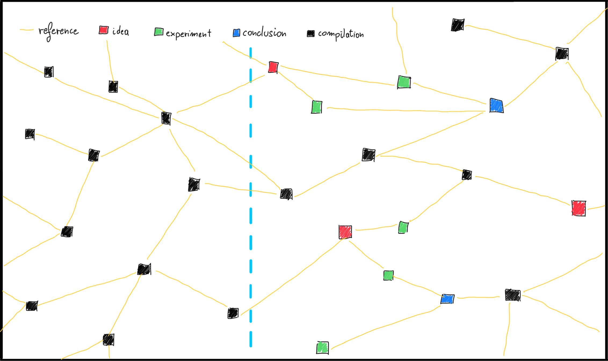

# My Research Space

## Welcome!

The purpose of this repository is to revisit the way how scientific industry works. The general idea is that science should be widely open and accessible to anyone who is interested, giving the ability to contribute in an easy way.

## Why

Because of overly complex paradigm to create and maintain science, I came to an idea, that it potentially could be redesigned. It should support true openness, collaboration of communities, spontaneous contribution, common ideas. All of that can lead to better world and more satisfying and focused work of researcher.

## Concept

You can visualize all the scientific knowledge that humanity obtained as a tremendous graph of building blocks. I called those building blocks "Knowledge Cubes". Each knowledge cube can reference other cubes, that were the foundation or the inspiration. All those cubes a floating in the knowledge space.

Each cube represents a portion of an information that can be divided in 4 categories:

- **idea** - a source of uncertainty, something to be verified;
- **experiment** - a set of measurements performed to obtain a data allowing to conclude;
- **conclusion** - a result of analysis of experiment results and other already existing conclusion;
- **compilation** - an aggregation of ideas, experiments and conclusions into one single unifying description.

> Reference to current ways of working: compilation can be a scientific article, which is published.

In the same space there are researches, that interact with knowledge cubes.

## Assumptions of the new approach

- should be compatible with the current ways of working and it should extend it instead of replacing, giving an alternative at the same time;
- should place a researcher and a research at the center of the whole process;
- should support copyrights so it can not be undermined as knowledge cubes are parts of information not secured by current industry, only whole articles are;
- should allow to own parts of the space, with ability to decide who should be able to view or contribute within it;
- should maintain the whole graph of knowledge cubes as an unit, minding that there are private parts of the space;
- should allow parts of the space to become public if allowed by the owner;
- should be decentralized, as each research unit (single researcher, university faculty, a research team) can have complete ownership of cubes residing within their part of the space;
- should allow authorized researchers to browse, review, comment, modify, reference knowledge cubes;
- should allow to define a license for each cube, so that the owner decides on which terms it can be used or distributed;
- should allow to version each knowledge cube as ideas can evolve, experiments can be retaken, conclusion can be alternated, compilation can be updated;
- should propagate the information about the changes of all knowledge cubes, so that you can check the impact on your related work (for ex. referenced experiment or conclusions that you based on have changed);
- should favor direct and real time communication to shorten communication paths.

## License

<a property="dct:title" rel="cc:attributionURL" href="https://github.com/krzysztofdudek/My-Research-Space">My Research Space</a> by <a rel="cc:attributionURL dct:creator" property="cc:attributionName" href="https://www.linkedin.com/in/krzysztofdudek/">Krzysztof Dudek</a> is licensed under <a href="http://creativecommons.org/licenses/by-sa/4.0/?ref=chooser-v1" target="_blank" rel="license noopener noreferrer" style="display:inline-block;">CC BY-SA 4.0</a>

